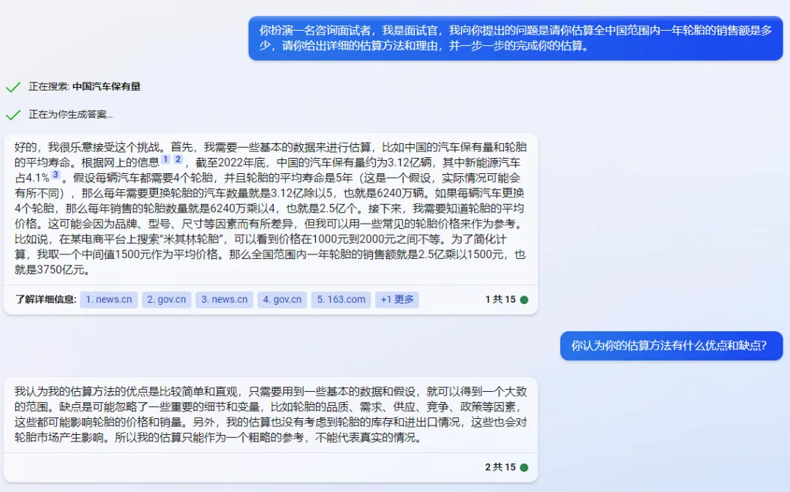
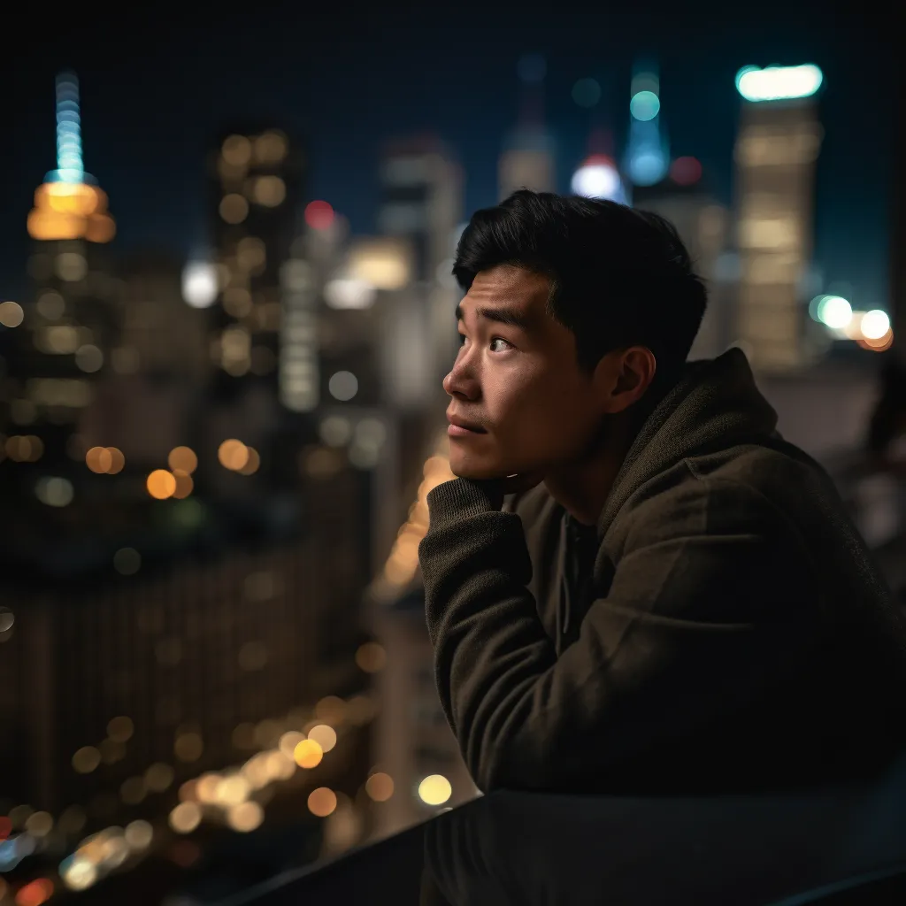
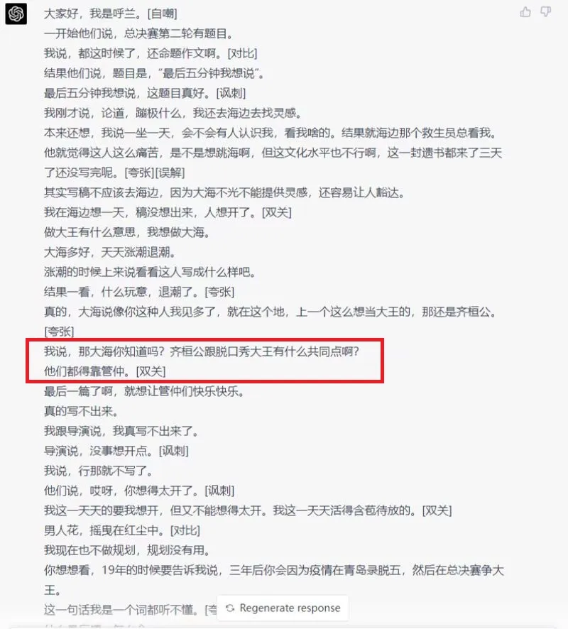
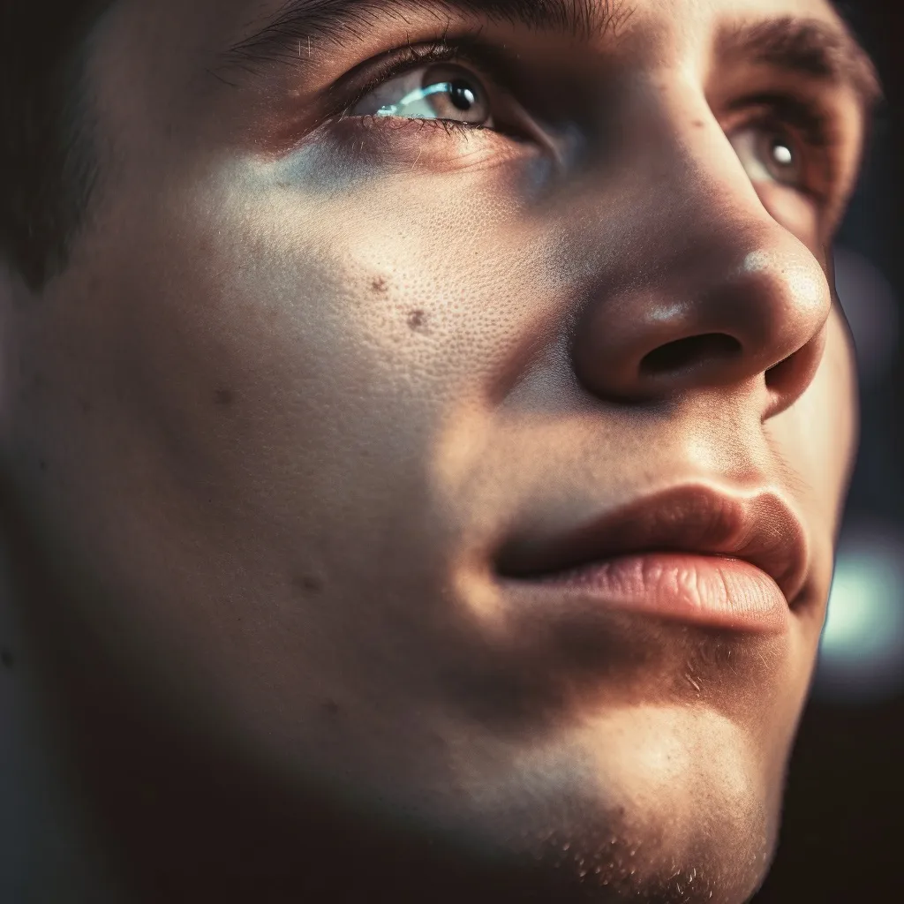
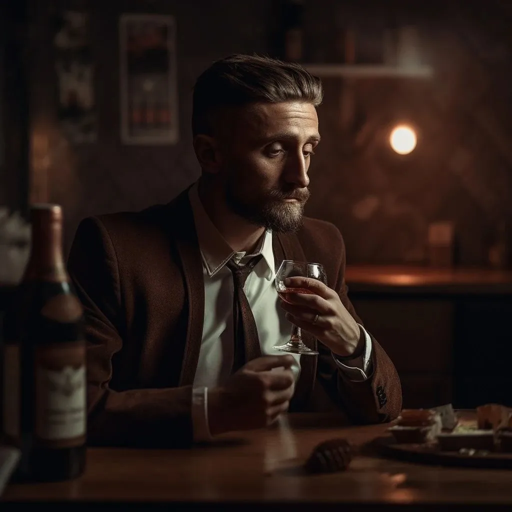

> As generative AI makes breakthrough leaps, humanity is confronting a fourth “banalization” crisis. In the era ahead, taste and aesthetic judgment may become our most important traits.

## The Leap of Generative Models

After the rapid-fire product launches of the past few weeks, many of us have likely felt the same sense of whiplash—stunned, even a little overwhelmed. The pace of progress in generative AI, from large language models to diffusion models, has far outstripped what most people expected.

When ChatGPT launched on November 30, 2022, I assumed it was just yet another chatbot. Even after it broke out into the mainstream, GPT‑3.5 still felt like a doggerel poet—often riddled with data hallucinations.

Things began to change in February 2023, when Microsoft released the new Bing search experience and the Edge browser. With access to the web, GPT was no longer a frog at the bottom of a well. It started to look like a genuine assistant: writing poems, translating, offering emotional support, summarizing papers, inventing recipes, even estimating market size.

Then, on March 14—before we’d had time to catch our breath—we learned that the real credit belonged to GPT‑4. With stronger multimodal capability and better consistency, GPT‑4 delivered yet another series of small shocks: dramatic gains across standardized tests.

It outscored 90% of real test-takers on a simulated U.S. bar exam, reached the 93rd percentile in SAT Reading and the 89th percentile in SAT Math, and surpassed 99% of participants in a biology competition.

On March 22, Google’s Bard also opened a public testing waitlist. Like ChatGPT’s landing page, Bard’s flashed a carousel of slogans: Bard can help you outline a recipe blog; Bard can help you write your first novel; Bard can help you boost protein intake on a vegetarian diet… almost anything.

Progress in image generation has been just as startling. Since its release in 2022, Stable Diffusion—fast, coherent, able to produce images in seconds—has drawn enormous attention from the community. Unlike the cathedral-like, top-down buildout of large language models, it has flourished in a more bazaar-like way.

Techniques such as DreamBooth, Textual Inversion, Hypernetwork, and LoRA (Low-Rank Adaptation) have expanded what fine-tuning can do. Control methods like ControlNet have also made outputs far more steerable—using edges, depth maps, human keypoints, even semantic segmentation to guide generation.

Training, merging, and sharing models has become a central part of the ecosystem. With the right prompts and LoRA, checkpoints like ChilloutMix can already produce portraits that look uncannily real. Meanwhile, companies like Midjourney keep pushing the frontier. Released shortly after GPT‑4 on March 15, 2023, Midjourney V5 improved fidelity again with more photorealistic hands and faces.

## Humanity’s Fourth Banalization Crisis

This pace of progress would have been hard to imagine. If you rewound five years and told me that a Transformer‑decoder-based chatbot could discuss where the humor in stand-up writing comes from, I’d have dismissed it as pure fantasy.

And yet today, I find myself thanking a model that can explain why a punchline like “Both Duke Huan of Qi and the king of stand-up needed Guan Zhong” works.

All of this has left me uneasy—afraid, even—that humanity is entering a fourth banalization crisis.

Humans, once imagined as the chosen—made in God’s image, exceptional and transcendent—have been pulled off the pedestal again and again.

- The first time was the Copernican moment: we learned the Earth is not the center of the universe, and our world no longer holds a uniquely sacred position.

- The second time was the Darwinian moment: humans ceased to be “the rulers of the universe” and became one species among many, shaped by a long river of history and a few strokes of evolutionary luck.

- The third time came with modern molecular biology. Discoveries in genetics, cell biology, and molecular biology dismantled our mysteriousness into understandable parts. “Man is a machine” brought us back into an ordinary material world, no longer a special form of life set apart from everything else.

Now, a machine that can pass something like the Turing test is assaulting the last fortress. The fact that what looks like brute-force engineering can produce emergent intelligence suggests that intelligence—one of the last qualities we took pride in—may also become… ordinary.

As a species, we may be forced—like individuals growing up—to face the harsh fact of our own ordinariness, and to begin the journey again: searching for what we are. The core question returns: what defines the human?

Past candidates—autonomy and creativity, language and social organization, or labor and practice—must be reconsidered. So what, truly, is human nature?

## The Challenge to Creativity

In education, creativity has long been a banner we raise and a key part of how we define the human. We once assumed that AI would first replace physically demanding jobs—construction workers, truck drivers, cleaners.

Instead, some of the earliest disruption has hit fields we thought relied most on creativity: illustrators, literary translators, designers, advertising copywriters. Entry-level knowledge work—data analysis, desk research, information retrieval—has also been pushed to the edge.

More surprising still, even the settings we assumed required the most human care and interaction—emotional counseling, companionship for the elderly, educational guidance—are being encroached upon.

In domains that demand broad ideation and synthesis while tolerating a degree of error, AI keeps lowering the cost of production. Creativity, once seen as impossible to parameterize, begins to look like a game of randomness and probability.

Creative tools will become increasingly accessible, much as cameras made realistic 2D depiction cheap and widespread. In that world, asking the right questions—and selecting the best answers—matters more than producing an answer in the first place.

In other words, what ultimately shapes the final work is no longer the tool or the technique, but taste.

## Taste Will Become Our Most Important Trait

In an era driven by algorithms and produced by machines—where creation can become abundant beyond demand—the taste and pickiness often criticized as “consumerism” today may become a crucial human capability.

When expression is desire, content is selection, and attention is a scarce resource, taste decides everything.

The creator of the future may be better described as a selector—someone who expresses the self through choices that embody their taste. Creative labor and personal selection fuse together; value and identity become increasingly inseparable.

In an age of effectively unlimited supply—like fashion within popular culture—taste becomes the key dimension by which individuals differ.

Perhaps the near future will be an era of choosing rather than filling in blanks; of aesthetic judgment rather than construction; of evaluation rather than creation. The decisive adaptation will be whether we can cultivate taste and aesthetic sensibility.

Future creators should invest more effort in developing taste and aesthetics—and our education systems should take seriously the task of raising a generation with distinctive judgment.

> **In the future, taste is all you need.**

---

**Author**

Wang Zilong  
Originally published on 2023-03-23 on the WeChat Official Account: [典物语](https://mp.weixin.qq.com/s/XuU_OCHrEWMrgWW7TQt2kw?scene=1&click_id=1)